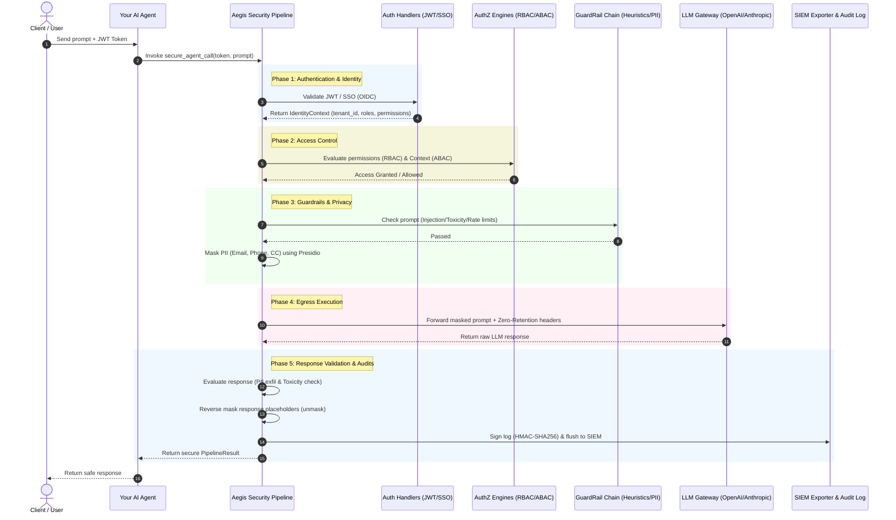

# Aegis AI SDK — Agent Integration & Security Workflow

This document explains how to wrap the Aegis AI SDK around any AI Agent, and describes the detailed step-by-step E2E workflow from authentication to compliance checks.

---

## 🔄 1. Wrapper Pattern: Integrating Aegis with an Agent

To protect an AI Agent, you wrap the agent's LLM calling method with the `SecurityPipeline`.

```python
import asyncio
from aegis_ai.settings import AegisSettings
from aegis_ai.pipeline import PipelineConfig, SecurityPipeline
from aegis_ai.proxy.llm_gateway import LLMRequest, LLMMessage

# 1. Initialize Aegis (typically done once at application startup)
settings = AegisSettings()
config = PipelineConfig(settings)
security_pipeline = SecurityPipeline(config)

class YourAgent:
    def __init__(self, agent_id: str):
        self.agent_id = agent_id

    async def get_response(self, user_prompt: str, user_jwt_token: str) -> str:
        # Create LLM request object
        llm_request = LLMRequest(
            provider="openai",
            model="gpt-4o",
            messages=[LLMMessage(role="user", content=user_prompt)]
        )

        try:
            # Wrap the calling logic using Aegis SecurityPipeline
            async with security_pipeline.secure_agent_call(
                token=user_jwt_token,
                request=llm_request,
                required_permissions=["agents.call"],
                context={"allowed_cidrs": ["10.0.0.0/8"]}
            ) as result:
                # The response has successfully cleared auth, authz, rate limiting,
                # input guardrails, data masking, and output safety validation!
                return result.response

        except Exception as exc:
            # Access blocked, credentials invalid, or input flagged
            return f"Access Denied: {exc}"
```

---

## 🗺️ 2. Detailed End-to-End Workflow Diagram

When `secure_agent_call` is invoked, the request travels through a 9-step zero-trust lifecycle before the LLM returns the output.



---

## 🔍 3. Step-by-Step Execution Lifecycle

### Step 1: Authentication (AuthN)
- Aegis inspects the incoming token header to determine the authentication type.
- For JWT tokens: signature is cryptographically validated using the **RS256** public key. Token JTI is compared against the Redis blacklist to check for revocations.
- For SSO/OpenID Connect tokens: remote OIDC keys (JWKS) are fetched, cached, and checked.

### Step 2: Role & Scope Checks (RBAC)
- The validated token contains user roles (e.g. `AGENT_OPERATOR`, `DEVELOPER`).
- Aegis traverses hierarchical role relationships (e.g. `ADMIN` inherits `USER` permissions) to verify the user has the required permission (`agents.call`).

### Step 3: Dynamic Policies (ABAC)
- Aegis evaluates situational context (e.g. user IP address compared against allowed CIDR blocks, checking if MFA is enabled, and checking time-of-day restrictions).

### Step 4: Rate Limiting
- The request passes through sliding-window rate limit checks (backed by Redis or an in-memory queue) to protect LLMs against exhaustion attacks.

### Step 5: Input Guardrails & PII Masking
- **Injection & Toxicity Heuristics**: Prompt is decoded (to catch Base64 or ROT13 obfuscation) and matched against patterns to detect jailbreak payloads.
- **PII Masking**: Presidio analyzes the prompt. Discovered entities (emails, credit cards) are replaced with irreversible hashes or custom placeholders.

### Step 6: Secure LLM Call
- The gateway adds `X-Zero-Retention: true` headers.
- Connections are made using a strict SSL context (TLS 1.3 only, weak ciphers disabled).

### Step 7: Output Validation
- The returned LLM response is evaluated before returning to check for unintended toxicity or sensitive data leakages.

### Step 8: Decrypt & Restore
- Masked placeholders in the response are swapped back to their original values before returning the response to the agent.

### Step 9: Signed Auditing
- A cryptographic HMAC-SHA256 signature is generated for the event record. The entry is buffered and flushed to GCP Cloud Logging or SIEM exporters.
