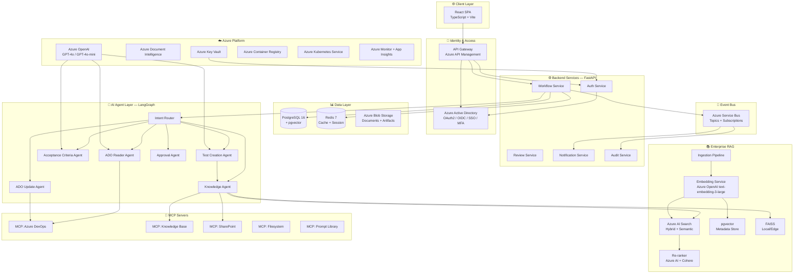
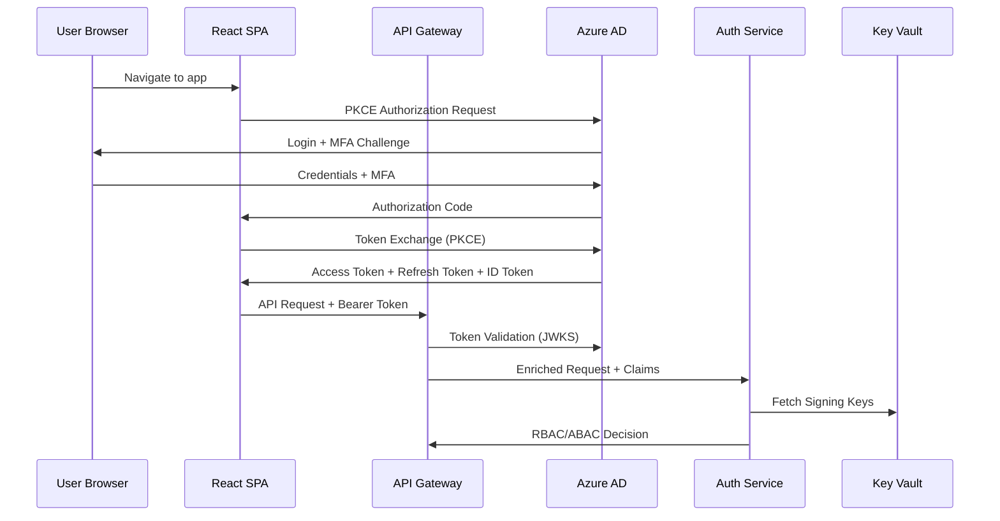
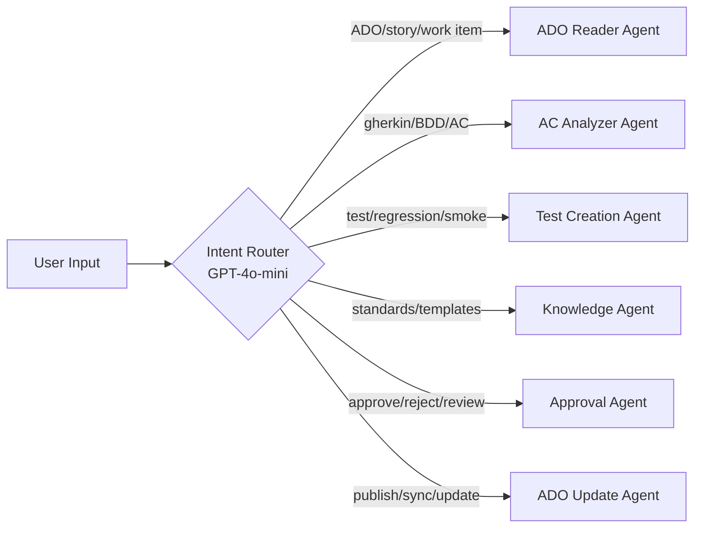
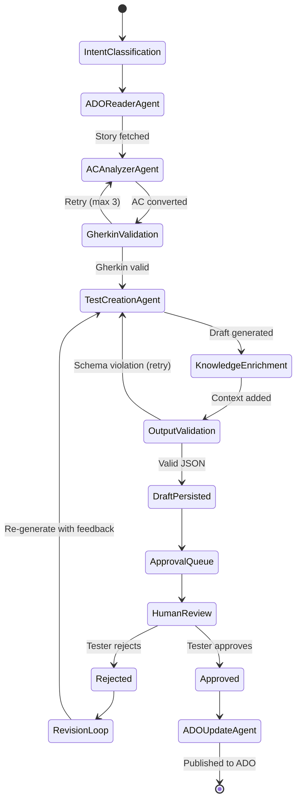
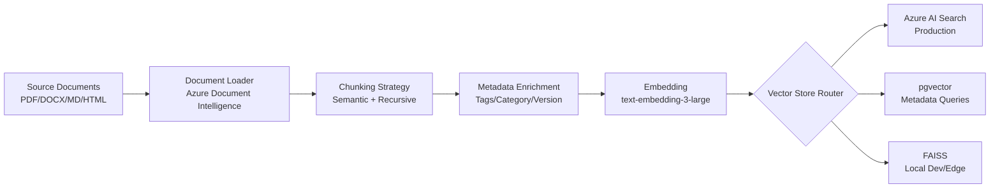
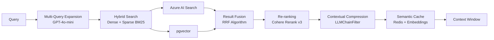
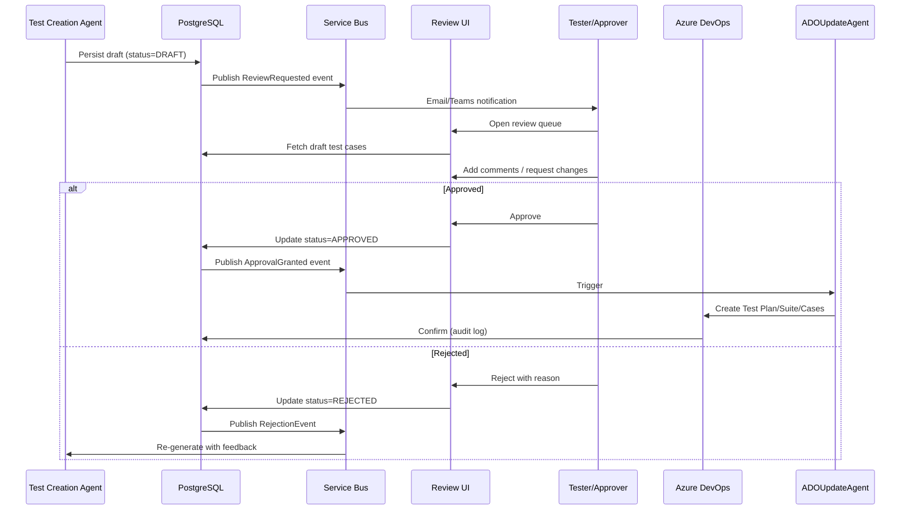

# Enterprise AI Test Automation Platform — Implementation Plan

> Principal Enterprise Architect · AI Solution Architect · Staff Software Engineer perspective
> Designed for Fortune 100 production deployment on Azure

---

## 1. Executive Architecture Overview

The **Enterprise AI Test Automation Platform** (EATAP) is a cloud-native, event-driven, multi-agent AI system that automates the generation, review, and publication of software test cases directly from Azure DevOps User Stories.

### Core Value Proposition
- **80-90% reduction** in manual test case authoring time
- **Zero unreviewed AI updates** to production ADO via mandatory human-in-the-loop
- **Enterprise-grade security** with Azure AD, RBAC, ABAC, and AI safety guardrails
- **Token-optimized** multi-agent routing to minimize LLM costs
- **Fully auditable** with immutable audit logs, version history, and change tracking

### System Capabilities
| Capability | Technology |
|---|---|
| Agentic Orchestration | LangGraph + LangChain |
| Knowledge Retrieval | Azure AI Search + FAISS + pgvector (Hybrid RAG) |
| Identity | Azure AD + OAuth2/OIDC + JWT |
| Backend | FastAPI (async) + Python 3.12 |
| Frontend | React 18 + TypeScript + Vite |
| Persistence | PostgreSQL 16 + Redis 7 |
| Messaging | Azure Service Bus / Kafka |
| Deployment | Azure AKS + Helm + Terraform |
| Observability | OpenTelemetry + Azure Monitor + Grafana |

---

## 2. High-Level Enterprise Architecture Diagram



---

## 3. Authentication & Authorization Design

### 3.1 Authentication Flow



### 3.2 Role Hierarchy & Permissions Matrix

| Permission | System Admin | QA Manager | Senior Tester | Tester | Developer | Approver | Architect | Read Only |
|---|---|---|---|---|---|---|---|---|
| Generate Test Cases | ✅ | ✅ | ✅ | ✅ | ✅ | — | ✅ | — |
| Approve/Reject | ✅ | ✅ | ✅ | — | — | ✅ | — | — |
| Update ADO | ✅ | ✅ | ✅ | — | — | ✅ | — | — |
| Manage Knowledge Base | ✅ | ✅ | — | — | — | — | ✅ | — |
| Upload Documents | ✅ | ✅ | ✅ | — | — | — | ✅ | — |
| View Audit Logs | ✅ | ✅ | ✅ | — | ✅ | ✅ | ✅ | ✅ |
| Prompt Management | ✅ | ✅ | — | — | — | — | ✅ | — |
| Agent Configuration | ✅ | — | — | — | — | — | ✅ | — |
| User Management | ✅ | — | — | — | — | — | — | — |

### 3.3 ABAC Policy Example
```json
{
  "policy": "test_case_approval",
  "conditions": {
    "user.department": "QA",
    "user.clearance_level": { "$gte": 3 },
    "resource.project": { "$in": "user.assigned_projects" },
    "resource.sensitivity": { "$lte": "user.max_sensitivity" },
    "environment.time": { "$between": ["08:00", "20:00"] }
  },
  "effect": "allow"
}
```

---

## 4. Complete Agent Architecture

### 4.1 Intent Router (Zero-Shot Classifier)
Routes user intent to the appropriate agent using a lightweight classifier (GPT-4o-mini) to avoid invoking expensive models unnecessarily.



### 4.2 Agent Specifications

| Agent | Model | Max Tokens (out) | Temperature | Specialization |
|---|---|---|---|---|
| Intent Router | GPT-4o-mini | 50 | 0.0 | Routing only |
| ADO Reader Agent | GPT-4o-mini | 1000 | 0.1 | API orchestration |
| AC Analyzer Agent | GPT-4o | 2000 | 0.2 | Gherkin conversion |
| Test Creation Agent | GPT-4o | 4000 | 0.3 | Test generation |
| Knowledge Agent | GPT-4o-mini | 500 | 0.0 | RAG retrieval |
| Approval Agent | GPT-4o-mini | 500 | 0.1 | Workflow logic |
| ADO Update Agent | GPT-4o-mini | 1000 | 0.0 | API write operations |

---

## 5. LangGraph Workflow



### 5.1 LangGraph State Schema
```python
class PlatformState(TypedDict):
    session_id: str
    user_story_id: str
    user_story: Optional[UserStory]
    gherkin_scenarios: Optional[list[GherkinScenario]]
    test_cases: Optional[list[TestCase]]
    knowledge_context: Optional[list[RetrievedChunk]]
    approval_status: ApprovalStatus  # DRAFT | IN_REVIEW | APPROVED | REJECTED
    revision_count: int
    reviewer_comments: list[ReviewComment]
    audit_trail: list[AuditEvent]
    error: Optional[str]
    next_agent: str
```

---

## 6. Enterprise RAG Architecture

### 6.1 Ingestion Pipeline



### 6.2 Retrieval Pipeline



### 6.3 Chunking Strategy
| Document Type | Strategy | Chunk Size | Overlap |
|---|---|---|---|
| Test Templates | Fixed + Semantic | 512 tokens | 64 tokens |
| Testing Standards | Recursive Character | 800 tokens | 100 tokens |
| Regulatory Docs | Parent-Child | 1500 / 300 tokens | 150 tokens |
| Existing Test Cases | Semantic | 400 tokens | 50 tokens |
| Business Rules | Fixed | 300 tokens | 40 tokens |

---

## 7. MCP Integration Architecture

### When MCP vs Direct API
| Scenario | Prefer | Reason |
|---|---|---|
| ADO read from agent | **MCP** | Tool abstraction, schema enforcement, retry logic |
| ADO write after approval | **MCP** | Audit trail built into MCP server |
| Real-time ADO webhooks | **Direct** | Low-latency, event-driven |
| SharePoint doc retrieval | **MCP** | Auth delegation, caching |
| Filesystem KB ingestion | **MCP** | Sandboxed, observable |
| High-frequency embedding | **Direct** | Latency-critical path |

### MCP Server Catalog
| Server | Protocol | Auth | Capabilities |
|---|---|---|---|
| `mcp-azure-devops` | HTTP/SSE | Azure AD Service Principal | read_story, read_tests, create_test_plan, create_test_case |
| `mcp-knowledge-base` | HTTP/SSE | Azure AD + RBAC | search, upload, delete, version |
| `mcp-sharepoint` | HTTP/SSE | OAuth2 Delegated | read_doc, read_library |
| `mcp-filesystem` | STDIO | Local | read_file, list_dir |
| `mcp-prompt-library` | HTTP/SSE | JWT | get_prompt, version_prompt |

---

## 8. Azure DevOps Integration Design

### 8.1 ADO Reader Agent — Fields Retrieved
```json
{
  "fields": [
    "System.Id", "System.Title", "System.Description",
    "Microsoft.VSTS.Common.AcceptanceCriteria",
    "System.AreaPath", "System.Tags",
    "System.State", "System.WorkItemType",
    "System.LinkTypes.Hierarchy.Forward"
  ]
}
```
> Only these fields fetched → minimizes token consumption

### 8.2 ADO Update Agent — Work Item Hierarchy
```
Test Plan (US-12345 Test Plan)
  └── Test Suite (Functional)
  │     └── TC-001: Happy Path Login
  │     └── TC-002: Invalid Credentials
  └── Test Suite (Boundary)
  │     └── TC-010: Max Field Length
  └── Test Suite (API)
        └── TC-020: POST /api/auth 200
        └── TC-021: POST /api/auth 401
```

---

## 9. Human Approval Workflow



### Approval UI Features
- **Side-by-side diff** view (AI-generated vs previous version)
- **Inline commenting** on individual test cases
- **Version history** with full change tracking
- **Bulk approve/reject** for efficiency
- **Immutable audit trail** — every action logged with timestamp, user, role, IP
- **Chat thread** per test case batch

---

## 10. Token Optimization Strategy

| Strategy | Implementation | Savings Estimate |
|---|---|---|
| Intent routing to mini-models | GPT-4o-mini for routing/simple tasks | 60-70% cost reduction |
| Semantic caching | Redis + embedding similarity (>0.92) | 30-40% cache hit rate |
| Context compression | LLMChainFilter + CohereRerank | 50% context reduction |
| Structured outputs | JSON mode + Pydantic schemas | Fewer retries |
| Metadata pre-filtering | Filter by document_type, project_id before embedding search | Top-K from 100→10 |
| Summary memory | ConversationSummaryMemory for long sessions | 70% token reduction vs full history |
| Parent-Child retrieval | Small child chunks retrieved, large parent sent | Better precision |
| Prompt templates | Versioned, reusable, parameterized | No prompt drift |
| Streaming | SSE streaming responses | Better UX, no timeout |
| Batch ADO calls | Parallel WIQL queries | Fewer API roundtrips |

---

## 11. Security Architecture

### 11.1 Defense in Depth

```
[Internet] → [Azure DDoS] → [WAF] → [APIM] → [AKS Ingress] → [mTLS] → [Services]
```

### 11.2 AI-Specific Security Controls
| Threat | Mitigation |
|---|---|
| Prompt Injection | Input sanitization + LlamaGuard screening |
| Data Exfiltration | Output validation + PII detection (Azure AI) |
| PII Leakage | Presidio anonymizer on all RAG inputs |
| Jailbreaking | Azure OpenAI Content Filter + custom guardrails |
| Model Inversion | No training on customer data |
| Token Stuffing | Max context limits enforced per agent |
| Secrets in Prompts | Azure Key Vault + env var injection only |
| SSRF via Agents | Allowlist-only MCP tool execution |

### 11.3 Secrets Management
```
Azure Key Vault
  ├── azure-openai-api-key
  ├── azure-search-api-key
  ├── ado-pat-token (encrypted)
  ├── db-connection-string
  ├── redis-connection-string
  └── jwt-signing-key
```

---

## 12. Event-Driven Architecture

### 12.1 Event Catalog
| Event | Topic | Publisher | Subscribers |
|---|---|---|---|
| `story.fetched` | ado-events | ADO Reader Agent | AC Analyzer Agent |
| `gherkin.generated` | gherkin-events | AC Analyzer Agent | Test Creation Agent |
| `testcases.drafted` | review-events | Test Creation Agent | Notification Service, Review Service |
| `review.requested` | approval-events | Review Service | Tester (email/Teams) |
| `testcases.approved` | approval-events | Approval Agent | ADO Update Agent, Audit Service |
| `testcases.rejected` | approval-events | Approval Agent | Test Creation Agent (re-gen) |
| `ado.updated` | ado-events | ADO Update Agent | Audit Service, Notification Service |
| `document.ingested` | kb-events | Ingestion Service | Embedding Service |

### 12.2 CQRS Pattern
- **Commands**: `GenerateTestCases`, `ApproveTestCases`, `RejectTestCases`, `PublishToADO`
- **Queries**: `GetDraftTestCases`, `GetApprovalHistory`, `GetAuditLog`, `SearchKnowledgeBase`
- Command handlers write to PostgreSQL → publish events to Service Bus
- Query handlers read from read-optimized PostgreSQL replicas + Redis cache

---

## 13. Database Design

### 13.1 Core Tables (PostgreSQL)

```sql
-- Users & Auth
CREATE TABLE users (
    id UUID PRIMARY KEY DEFAULT gen_random_uuid(),
    azure_oid VARCHAR(36) UNIQUE NOT NULL,
    email VARCHAR(255) UNIQUE NOT NULL,
    display_name VARCHAR(255),
    roles JSONB DEFAULT '[]',
    attributes JSONB DEFAULT '{}',
    created_at TIMESTAMPTZ DEFAULT NOW(),
    updated_at TIMESTAMPTZ DEFAULT NOW()
);

-- Test Generation Sessions
CREATE TABLE test_generation_sessions (
    id UUID PRIMARY KEY DEFAULT gen_random_uuid(),
    user_story_id VARCHAR(50) NOT NULL,
    project_key VARCHAR(100) NOT NULL,
    status VARCHAR(20) NOT NULL DEFAULT 'DRAFT',
    created_by UUID REFERENCES users(id),
    revision_count INTEGER DEFAULT 0,
    metadata JSONB DEFAULT '{}',
    created_at TIMESTAMPTZ DEFAULT NOW(),
    updated_at TIMESTAMPTZ DEFAULT NOW()
);

-- Generated Test Cases
CREATE TABLE test_cases (
    id UUID PRIMARY KEY DEFAULT gen_random_uuid(),
    session_id UUID REFERENCES test_generation_sessions(id),
    title VARCHAR(500) NOT NULL,
    type VARCHAR(50) NOT NULL,
    gherkin_text TEXT,
    steps JSONB,
    priority VARCHAR(20),
    tags JSONB DEFAULT '[]',
    ado_test_case_id VARCHAR(50),
    version INTEGER DEFAULT 1,
    created_at TIMESTAMPTZ DEFAULT NOW()
);

-- Immutable Audit Log
CREATE TABLE audit_log (
    id UUID PRIMARY KEY DEFAULT gen_random_uuid(),
    session_id UUID,
    actor_id UUID REFERENCES users(id),
    action VARCHAR(100) NOT NULL,
    entity_type VARCHAR(50),
    entity_id UUID,
    payload JSONB,
    ip_address INET,
    user_agent TEXT,
    created_at TIMESTAMPTZ DEFAULT NOW()
) PARTITION BY RANGE (created_at);

-- Knowledge Base Documents
CREATE TABLE kb_documents (
    id UUID PRIMARY KEY DEFAULT gen_random_uuid(),
    filename VARCHAR(500) NOT NULL,
    category VARCHAR(100),
    version INTEGER DEFAULT 1,
    chunk_count INTEGER,
    embedding_model VARCHAR(100),
    uploaded_by UUID REFERENCES users(id),
    azure_blob_path VARCHAR(1000),
    is_active BOOLEAN DEFAULT TRUE,
    metadata JSONB DEFAULT '{}',
    created_at TIMESTAMPTZ DEFAULT NOW()
);
```

### 13.2 Redis Key Schema
```
session:{session_id}           → Session state (TTL: 24h)
user:{user_id}:permissions     → RBAC permissions (TTL: 15min)
semantic_cache:{query_hash}    → RAG results (TTL: 1h)
rate_limit:{user_id}:{endpoint} → Request count (TTL: 60s)
ado_story:{story_id}           → Cached ADO story (TTL: 5min)
```

---

## 14. Folder Structure

```
enterprise-ai-platform/
│
├── frontend/                          # React 18 + TypeScript + Vite
│   ├── src/
│   │   ├── app/                       # App shell, routing, providers
│   │   ├── features/                  # Feature-sliced design
│   │   │   ├── auth/                  # MSAL, token management
│   │   │   ├── dashboard/             # Main dashboard
│   │   │   ├── story-search/          # US ID input + ADO fetch
│   │   │   ├── gherkin-viewer/        # Gherkin display + edit
│   │   │   ├── test-cases/            # Generated test case list
│   │   │   ├── approval-queue/        # Review queue + bulk ops
│   │   │   ├── review/                # Diff viewer + comments
│   │   │   ├── audit-logs/            # Audit trail viewer
│   │   │   ├── knowledge-base/        # Upload + manage KB docs
│   │   │   ├── prompt-library/        # Prompt management UI
│   │   │   └── admin/                 # User/role/settings admin
│   │   ├── shared/                    # Design system components
│   │   ├── hooks/                     # Custom React hooks
│   │   ├── services/                  # API client layer
│   │   └── store/                     # Zustand state management
│   ├── public/
│   └── vite.config.ts
│
├── backend/
│   ├── app/
│   │   ├── api/                       # FastAPI routers
│   │   │   ├── v1/
│   │   │   │   ├── auth.py
│   │   │   │   ├── stories.py
│   │   │   │   ├── test_cases.py
│   │   │   │   ├── approvals.py
│   │   │   │   ├── knowledge.py
│   │   │   │   ├── audit.py
│   │   │   │   └── admin.py
│   │   ├── core/                      # Config, security, middleware
│   │   │   ├── config.py
│   │   │   ├── security.py
│   │   │   ├── middleware.py
│   │   │   └── dependencies.py
│   │   ├── domain/                    # DDD — Domain models
│   │   │   ├── test_generation/
│   │   │   ├── approval/
│   │   │   ├── knowledge/
│   │   │   └── audit/
│   │   ├── infrastructure/            # Repository implementations
│   │   │   ├── database/
│   │   │   ├── cache/
│   │   │   ├── blob/
│   │   │   └── messaging/
│   │   └── services/                  # Application services (CQRS)
│
├── agents/
│   ├── base/                          # BaseAgent, RetryPolicy, CircuitBreaker
│   ├── intent_router/                 # Zero-shot intent classifier
│   ├── ado_reader/                    # ADO Reader Agent
│   ├── acceptance_criteria/           # AC Analyzer + Gherkin Agent
│   ├── test_creation/                 # Test Creation Agent
│   ├── knowledge/                     # Knowledge/RAG Agent
│   ├── approval/                      # Approval workflow agent
│   └── ado_update/                    # ADO Writer Agent
│
├── rag/
│   ├── ingestion/                     # Document loading + chunking
│   │   ├── loaders/                   # PDF, DOCX, MD, HTML loaders
│   │   ├── chunkers/                  # Semantic, recursive chunkers
│   │   ├── enrichers/                 # Metadata enrichment
│   │   └── pipeline.py
│   ├── embeddings/                    # Embedding service + caching
│   ├── retrieval/                     # Hybrid search, re-ranking
│   │   ├── hybrid_search.py
│   │   ├── reranker.py
│   │   ├── compression.py
│   │   └── cache.py
│   └── vector_stores/                 # AIS, pgvector, FAISS adapters
│
├── workflows/
│   └── langgraph/
│       ├── state.py                   # PlatformState TypedDict
│       ├── graph.py                   # LangGraph graph definition
│       ├── nodes/                     # Individual graph nodes
│       ├── edges/                     # Conditional edge logic
│       └── checkpointer.py            # PostgreSQL-backed checkpointing
│
├── auth/
│   ├── azure_ad.py                    # MSAL / OIDC token validation
│   ├── jwt_handler.py
│   ├── rbac.py                        # Role-based access control
│   ├── abac.py                        # Attribute-based access control
│   └── policies/                      # OPA-compatible policy files
│
├── security/
│   ├── prompt_guard.py                # Prompt injection detection
│   ├── pii_detector.py                # Presidio integration
│   ├── content_filter.py              # Azure AI Content Safety
│   ├── rate_limiter.py                # Redis-backed rate limiting
│   └── secrets.py                     # Key Vault client
│
├── events/
│   ├── publishers/                    # Service Bus publishers
│   ├── consumers/                     # Service Bus consumers
│   ├── schemas/                       # Event schemas (Pydantic)
│   └── handlers/                      # Event handler implementations
│
├── mcp/
│   ├── servers/
│   │   ├── azure_devops/              # MCP ADO server
│   │   ├── knowledge_base/            # MCP KB server
│   │   ├── sharepoint/                # MCP SharePoint server
│   │   ├── filesystem/                # MCP filesystem server
│   │   └── prompt_library/            # MCP prompt server
│   └── client.py                      # MCP client wrapper
│
├── prompts/
│   ├── system/                        # System prompts per agent
│   ├── templates/                     # Parameterized Jinja2 templates
│   └── versioning.py                  # Prompt version management
│
├── tests/
│   ├── unit/                          # pytest unit tests
│   ├── integration/                   # Integration tests
│   ├── e2e/                           # Playwright E2E tests
│   └── load/                          # k6 load tests
│
├── deployment/
│   ├── helm/                          # Helm charts
│   │   ├── frontend/
│   │   ├── backend/
│   │   ├── agents/
│   │   └── rag/
│   ├── kubernetes/                    # Raw K8s manifests (fallback)
│   └── scripts/                       # Deploy/rollback scripts
│
├── infrastructure/
│   ├── terraform/
│   │   ├── modules/
│   │   │   ├── aks/
│   │   │   ├── azure_openai/
│   │   │   ├── azure_search/
│   │   │   ├── postgresql/
│   │   │   ├── redis/
│   │   │   └── networking/
│   │   ├── environments/
│   │   │   ├── dev/
│   │   │   ├── staging/
│   │   │   └── prod/
│   │   └── main.tf
│   └── bicep/                         # Bicep alternative
│
├── docs/
│   ├── architecture/
│   ├── api/                           # OpenAPI specs
│   ├── runbooks/
│   └── adr/                           # Architecture Decision Records
│
└── .github/
    └── workflows/                     # GitHub Actions CI/CD
```

---

## 15. Python Code Samples

### 15.1 FastAPI App Entry + Config
```python
# backend/app/main.py
from contextlib import asynccontextmanager
from fastapi import FastAPI
from fastapi.middleware.cors import CORSMiddleware
from app.core.config import settings
from app.core.middleware import (
    RequestIdMiddleware, AuditMiddleware,
    RateLimitMiddleware, SecurityHeadersMiddleware
)
from app.api.v1 import auth, stories, test_cases, approvals, knowledge, audit

@asynccontextmanager
async def lifespan(app: FastAPI):
    # Startup: init DB pools, Redis, Service Bus consumers
    await startup_services()
    yield
    # Shutdown: graceful drain
    await shutdown_services()

app = FastAPI(
    title="Enterprise AI Test Automation Platform",
    version="1.0.0",
    lifespan=lifespan,
    docs_url="/api/docs" if settings.ENVIRONMENT != "production" else None,
    redoc_url=None,
    openapi_url="/api/openapi.json" if settings.ENVIRONMENT != "production" else None,
)

app.add_middleware(SecurityHeadersMiddleware)
app.add_middleware(RateLimitMiddleware, redis_url=settings.REDIS_URL)
app.add_middleware(AuditMiddleware)
app.add_middleware(RequestIdMiddleware)
app.add_middleware(CORSMiddleware, allow_origins=settings.ALLOWED_ORIGINS, ...)

app.include_router(auth.router, prefix="/api/v1/auth", tags=["auth"])
app.include_router(stories.router, prefix="/api/v1/stories", tags=["stories"])
app.include_router(test_cases.router, prefix="/api/v1/test-cases", tags=["test-cases"])
app.include_router(approvals.router, prefix="/api/v1/approvals", tags=["approvals"])
app.include_router(knowledge.router, prefix="/api/v1/knowledge", tags=["knowledge"])
app.include_router(audit.router, prefix="/api/v1/audit", tags=["audit"])
```

### 15.2 LangGraph Platform State & Graph
```python
# workflows/langgraph/state.py
from typing import TypedDict, Optional, Annotated
from langgraph.graph.message import add_messages
from datetime import datetime
from enum import Enum

class ApprovalStatus(str, Enum):
    DRAFT = "DRAFT"
    IN_REVIEW = "IN_REVIEW"
    APPROVED = "APPROVED"
    REJECTED = "REJECTED"

class PlatformState(TypedDict):
    session_id: str
    user_id: str
    user_story_id: str
    project_key: str
    user_story: Optional[dict]
    gherkin_scenarios: Optional[list[dict]]
    test_cases: Optional[list[dict]]
    knowledge_context: Optional[list[dict]]
    approval_status: ApprovalStatus
    revision_count: int
    max_revisions: int
    reviewer_comments: list[dict]
    audit_trail: Annotated[list[dict], add_messages]
    error: Optional[str]
    next_node: str
    token_usage: dict  # Track per-node token consumption
    started_at: datetime
```

```python
# workflows/langgraph/graph.py
from langgraph.graph import StateGraph, END
from langgraph.checkpoint.postgres.aio import AsyncPostgresSaver
from .state import PlatformState, ApprovalStatus
from .nodes import (
    intent_router_node, ado_reader_node, ac_analyzer_node,
    test_creation_node, knowledge_enrichment_node,
    output_validation_node, approval_queue_node
)

def should_retry_ac(state: PlatformState) -> str:
    if state.get("error") and state["revision_count"] < 3:
        return "ac_analyzer"
    return "test_creation"

def should_retry_test(state: PlatformState) -> str:
    if state.get("error") and state["revision_count"] < state["max_revisions"]:
        return "test_creation"
    return END

def approval_routing(state: PlatformState) -> str:
    match state["approval_status"]:
        case ApprovalStatus.APPROVED: return "ado_update"
        case ApprovalStatus.REJECTED: return "test_creation"
        case _: return END

def build_platform_graph(checkpointer) -> StateGraph:
    graph = StateGraph(PlatformState)
    
    graph.add_node("intent_router", intent_router_node)
    graph.add_node("ado_reader", ado_reader_node)
    graph.add_node("ac_analyzer", ac_analyzer_node)
    graph.add_node("test_creation", test_creation_node)
    graph.add_node("knowledge_enrichment", knowledge_enrichment_node)
    graph.add_node("output_validation", output_validation_node)
    graph.add_node("approval_queue", approval_queue_node)

    graph.set_entry_point("intent_router")
    graph.add_edge("intent_router", "ado_reader")
    graph.add_edge("ado_reader", "ac_analyzer")
    graph.add_conditional_edges("ac_analyzer", should_retry_ac)
    graph.add_edge("test_creation", "knowledge_enrichment")
    graph.add_edge("knowledge_enrichment", "output_validation")
    graph.add_conditional_edges("output_validation", should_retry_test)
    graph.add_edge("output_validation", "approval_queue")
    graph.add_conditional_edges("approval_queue", approval_routing)

    return graph.compile(checkpointer=checkpointer, interrupt_before=["approval_queue"])
```

### 15.3 Enterprise RAG Retrieval Service
```python
# rag/retrieval/hybrid_search.py
from langchain_community.vectorstores import AzureSearch
from langchain.retrievers import EnsembleRetriever, ContextualCompressionRetriever
from langchain.retrievers.document_compressors import CohereRerank
from langchain_openai import AzureOpenAIEmbeddings
from langchain.retrievers.multi_query import MultiQueryRetriever

class EnterpriseRAGRetriever:
    def __init__(self, config: RAGConfig):
        self.embeddings = AzureOpenAIEmbeddings(
            model="text-embedding-3-large",
            azure_endpoint=config.aoai_endpoint,
            api_key=config.aoai_key,
        )
        self.azure_search = AzureSearch(
            azure_search_endpoint=config.search_endpoint,
            azure_search_key=config.search_key,
            index_name=config.index_name,
            embedding_function=self.embeddings.embed_query,
        )
        self.reranker = CohereRerank(
            cohere_api_key=config.cohere_key,
            top_n=5,
            model="rerank-english-v3.0",
        )

    async def retrieve(
        self,
        query: str,
        filters: dict | None = None,
        top_k: int = 10,
    ) -> list[Document]:
        # Multi-query expansion for better recall
        multi_query_retriever = MultiQueryRetriever.from_llm(
            retriever=self.azure_search.as_retriever(
                search_type="hybrid",
                search_kwargs={"k": top_k, "filters": filters},
            ),
            llm=self.router_llm,  # GPT-4o-mini — cheap
        )
        # Contextual compression + reranking
        compression_retriever = ContextualCompressionRetriever(
            base_compressor=self.reranker,
            base_retriever=multi_query_retriever,
        )
        docs = await compression_retriever.ainvoke(query)
        return docs
```

### 15.4 Base Agent with Circuit Breaker
```python
# agents/base/base_agent.py
import asyncio
from abc import ABC, abstractmethod
from tenacity import retry, stop_after_attempt, wait_exponential, retry_if_exception_type
from circuitbreaker import circuit
from opentelemetry import trace
from structlog import get_logger

logger = get_logger()
tracer = trace.get_tracer(__name__)

class BaseAgent(ABC):
    name: str
    model: str = "gpt-4o"
    max_retries: int = 3

    @retry(
        stop=stop_after_attempt(3),
        wait=wait_exponential(multiplier=1, min=4, max=30),
        retry=retry_if_exception_type((RateLimitError, ServiceUnavailableError)),
    )
    @circuit(failure_threshold=5, recovery_timeout=60, expected_exception=Exception)
    async def run(self, state: PlatformState) -> PlatformState:
        with tracer.start_as_current_span(f"agent.{self.name}") as span:
            span.set_attribute("agent.name", self.name)
            span.set_attribute("session.id", state["session_id"])
            try:
                logger.info("agent_started", agent=self.name, session=state["session_id"])
                result = await self._execute(state)
                logger.info("agent_completed", agent=self.name, tokens=result.get("token_usage"))
                return result
            except Exception as e:
                logger.error("agent_failed", agent=self.name, error=str(e))
                raise

    @abstractmethod
    async def _execute(self, state: PlatformState) -> PlatformState:
        ...
```

### 15.5 ADO Reader Agent
```python
# agents/ado_reader/agent.py
from langchain_openai import AzureChatOpenAI
from langchain_core.prompts import ChatPromptTemplate
from langchain_core.output_parsers import JsonOutputParser
from agents.base.base_agent import BaseAgent
from mcp.client import MCPClient
from security.pii_detector import PIIDetector

class ADOReaderAgent(BaseAgent):
    name = "ado_reader"
    model = "gpt-4o-mini"  # Cheap — primarily API orchestration

    def __init__(self, mcp_client: MCPClient, pii_detector: PIIDetector):
        self.mcp = mcp_client
        self.pii = pii_detector
        self.llm = AzureChatOpenAI(model=self.model, temperature=0.0, max_tokens=1000)

    async def _execute(self, state: PlatformState) -> PlatformState:
        story_id = state["user_story_id"]
        
        # Fetch only required fields via MCP (token-optimized)
        raw_story = await self.mcp.call_tool(
            server="azure_devops",
            tool="read_work_item",
            args={
                "id": story_id,
                "fields": REQUIRED_ADO_FIELDS,  # Minimal field list
                "expand": ["Relations", "Links"],
            },
        )
        
        # PII detection before passing to LLM
        sanitized = self.pii.anonymize(raw_story)
        
        # Parse and structure the story
        parser = JsonOutputParser(pydantic_object=UserStory)
        prompt = STORY_PARSE_PROMPT  # Versioned from prompt library
        chain = prompt | self.llm | parser
        
        user_story = await chain.ainvoke({"raw_story": sanitized})
        
        return {
            **state,
            "user_story": user_story,
            "next_node": "ac_analyzer",
        }
```

### 15.6 Security — Prompt Guard
```python
# security/prompt_guard.py
import re
from dataclasses import dataclass
from langchain_community.llms import AzureOpenAI

INJECTION_PATTERNS = [
    r"ignore previous instructions",
    r"forget your system prompt",
    r"you are now",
    r"act as",
    r"disregard",
    r"override",
    r"bypass",
]

@dataclass
class GuardResult:
    is_safe: bool
    risk_score: float
    detected_patterns: list[str]
    sanitized_input: str

class PromptGuard:
    def __init__(self, threshold: float = 0.7):
        self.threshold = threshold
        
    def check(self, user_input: str) -> GuardResult:
        detected = []
        sanitized = user_input
        
        for pattern in INJECTION_PATTERNS:
            if re.search(pattern, user_input, re.IGNORECASE):
                detected.append(pattern)
                sanitized = re.sub(pattern, "[BLOCKED]", sanitized, flags=re.IGNORECASE)
        
        risk_score = len(detected) / len(INJECTION_PATTERNS)
        
        return GuardResult(
            is_safe=risk_score < self.threshold,
            risk_score=risk_score,
            detected_patterns=detected,
            sanitized_input=sanitized,
        )
```

---

## 16. React Application Structure

```
frontend/src/
├── app/
│   ├── App.tsx                    # Root with MsalProvider + Router
│   ├── router.tsx                 # React Router v6 with auth guards
│   └── providers.tsx              # Theme, Query, Toast providers
├── features/
│   ├── auth/
│   │   ├── components/            # LoginPage, LogoutButton, RoleGuard
│   │   ├── hooks/                 # useAuth, usePermissions
│   │   └── msal.config.ts         # MSAL PublicClientApplication config
│   ├── dashboard/
│   │   ├── DashboardPage.tsx      # KPI cards, recent activity, quick actions
│   │   └── components/            # StatCard, ActivityFeed, QuickAction
│   ├── story-search/
│   │   ├── StorySearchPage.tsx    # US ID input, ADO story preview
│   │   └── components/            # StoryIdInput, StoryCard, AcceptanceCriteriaPreview
│   ├── gherkin-viewer/
│   │   ├── GherkinPage.tsx        # Gherkin display with syntax highlighting
│   │   └── components/            # GherkinScenario, EditableGherkin
│   ├── test-cases/
│   │   ├── TestCasesPage.tsx      # Generated test cases list + filters
│   │   └── components/            # TestCaseCard, TestTypeFilter, ExportButton
│   ├── approval-queue/
│   │   ├── ApprovalQueuePage.tsx  # Review queue + bulk approve/reject
│   │   └── components/            # QueueItem, BulkActions, StatusBadge
│   ├── review/
│   │   ├── ReviewPage.tsx         # Side-by-side diff + inline comments
│   │   └── components/            # DiffViewer, CommentThread, VersionHistory
│   ├── audit-logs/
│   │   ├── AuditLogsPage.tsx
│   │   └── components/            # AuditTable, FilterBar, ExportCSV
│   ├── knowledge-base/
│   │   ├── KnowledgeBasePage.tsx
│   │   └── components/            # DocumentUpload, DocumentList, CategoryFilter
│   └── admin/
│       ├── AdminPage.tsx
│       └── components/            # UserTable, RoleAssignment, SettingsForm
├── shared/
│   ├── components/                # Button, Input, Modal, Table, Badge
│   ├── layout/                    # AppShell, Sidebar, TopBar, Breadcrumbs
│   └── ui/                        # Design system tokens
├── hooks/
│   ├── useApi.ts                  # Axios + MSAL token injection
│   ├── useWebSocket.ts            # SSE/WS for streaming
│   └── usePermissions.ts          # RBAC hook
└── services/
    ├── api.client.ts              # Base Axios client
    ├── stories.service.ts
    ├── testcases.service.ts
    ├── approvals.service.ts
    └── knowledge.service.ts
```

---

## 17. Deployment Architecture (AKS + Azure)

### 17.1 AKS Cluster Layout
```
AKS Cluster (Production)
├── System Node Pool       (3x Standard_D4s_v5) — kube-system
├── App Node Pool          (5-20x Standard_D8s_v5) — KEDA autoscale
└── GPU Node Pool          (2x Standard_NC24s_v3) — embedding workloads (optional)

Namespaces:
├── eatap-prod             # Main application workloads
├── eatap-monitoring       # Prometheus, Grafana, Jaeger
├── eatap-ingress          # NGINX Ingress + Cert-Manager
└── eatap-security         # OPA Gatekeeper, Falco
```

### 17.2 Kubernetes Workloads
| Workload | Replicas | HPA Min/Max | Resources |
|---|---|---|---|
| frontend | 2 | 2/10 | 256m/512Mi |
| backend-api | 3 | 3/20 | 500m/1Gi |
| agent-orchestrator | 2 | 2/10 | 1000m/2Gi |
| rag-service | 2 | 2/8 | 1000m/2Gi |
| notification-service | 1 | 1/5 | 256m/512Mi |
| audit-service | 2 | 2/6 | 500m/1Gi |

---

## 18. CI/CD Pipeline

```yaml
# .github/workflows/main.yml — Simplified
stages:
  - lint:       ruff, mypy, eslint, prettier
  - test:       pytest (unit + integration), vitest
  - security:   bandit, trivy, OWASP ZAP
  - build:      Docker multi-stage → ACR push
  - deploy-dev: Helm upgrade → dev namespace
  - e2e:        Playwright tests on dev
  - deploy-staging: Helm upgrade → staging (blue-green)
  - approval:   Manual gate — QA Lead sign-off
  - deploy-prod: Canary 10% → 50% → 100%
  - smoke:      k6 smoke test on production
```

---

## 19. Monitoring & Observability

### 19.1 Observability Stack
| Layer | Tool | Purpose |
|---|---|---|
| Metrics | Prometheus + Grafana | Infrastructure + custom business metrics |
| Traces | OpenTelemetry + Jaeger | Distributed request tracing |
| Logs | Azure Monitor + Fluent Bit | Centralized structured logging |
| AI Metrics | LangSmith / Phoenix | LLM latency, token usage, accuracy |
| Alerts | Grafana Alerting + PagerDuty | On-call incident routing |
| SLOs | Grafana SLO Plugin | 99.9% API availability target |

### 19.2 Key Metrics
- `eatap_test_generation_duration_seconds` — per agent
- `eatap_token_usage_total{agent, model}` — cost tracking
- `eatap_approval_queue_depth` — review backlog
- `eatap_rag_retrieval_latency_seconds` — RAG performance
- `eatap_ado_update_success_total` — ADO write success rate

---

## 20. Cost Optimization

| Category | Strategy | Est. Savings |
|---|---|---|
| LLM Costs | Route simple tasks to GPT-4o-mini | 60-70% |
| LLM Costs | Semantic caching in Redis | 30-40% |
| Compute | KEDA autoscaling + spot node pools | 40-50% |
| Storage | Tiered blob storage (hot/cool/archive) | 30% |
| Search | Query-time metadata filtering | Reduce RU consumption |
| Network | Azure CDN for frontend | Egress cost reduction |

---

## 21. Risks & Mitigations

| Risk | Probability | Impact | Mitigation |
|---|---|---|---|
| LLM Hallucination in test cases | Medium | High | Schema validation + human approval mandatory |
| ADO API rate limiting | Medium | Medium | Exponential backoff + request queue |
| Azure OpenAI outage | Low | High | Multi-region failover + fallback model |
| PII leakage in test cases | Low | Critical | Presidio + output scanning before any storage |
| Prompt injection via AC fields | Medium | High | PromptGuard on all user inputs |
| Knowledge Base drift | Medium | Medium | Document versioning + staleness alerts |
| Token budget exhaustion | Medium | Medium | Per-session token budgets + circuit breaker |

---

## 22. Future Enhancements

1. **AI-powered test execution** — Run generated tests automatically via pytest/Playwright integration
2. **Test impact analysis** — Use code change embeddings to identify affected tests
3. **Multi-LLM support** — Add Anthropic Claude, Google Gemini as fallback providers
4. **Real-time collaboration** — WebSocket-based co-review (Google Docs style)
5. **Confluence/Jira bidirectional sync** — Extend MCP servers for additional ALM tools
6. **Knowledge Graph RAG** — Neo4j-based graph traversal for complex domain rules
7. **Fine-tuned domain model** — Fine-tune GPT-4o on organization's existing test cases
8. **Automated regression selection** — ML model to rank regression candidates by risk
9. **Natural language test search** — Semantic search across all generated test cases
10. **Mobile review app** — React Native app for on-the-go approvals

---

## Open Questions

> [!IMPORTANT]
> **Q1**: Do you want me to generate the **complete working code** for all components, or prioritize specific layers (agents, RAG, backend API, frontend)?

> [!IMPORTANT]
> **Q2**: Should the platform run in a **local Docker Compose** setup first (for development), or target **Azure AKS** directly from the start?

> [!IMPORTANT]
> **Q3**: For the **Knowledge Base**, will documents be stored in **Azure Blob Storage** (production path) or a **local filesystem** (simpler path to start)?

> [!IMPORTANT]
> **Q4**: Do you have an **Azure OpenAI** deployment already set up, or should I use standard **OpenAI API** with equivalent models (GPT-4o, text-embedding-3-large)?

> [!IMPORTANT]
> **Q5**: Do you want the **React frontend built and scaffolded** immediately alongside the Python backend, or backend-first?
